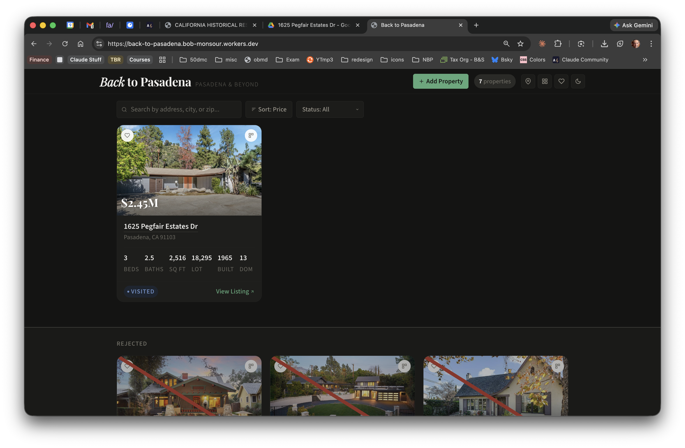
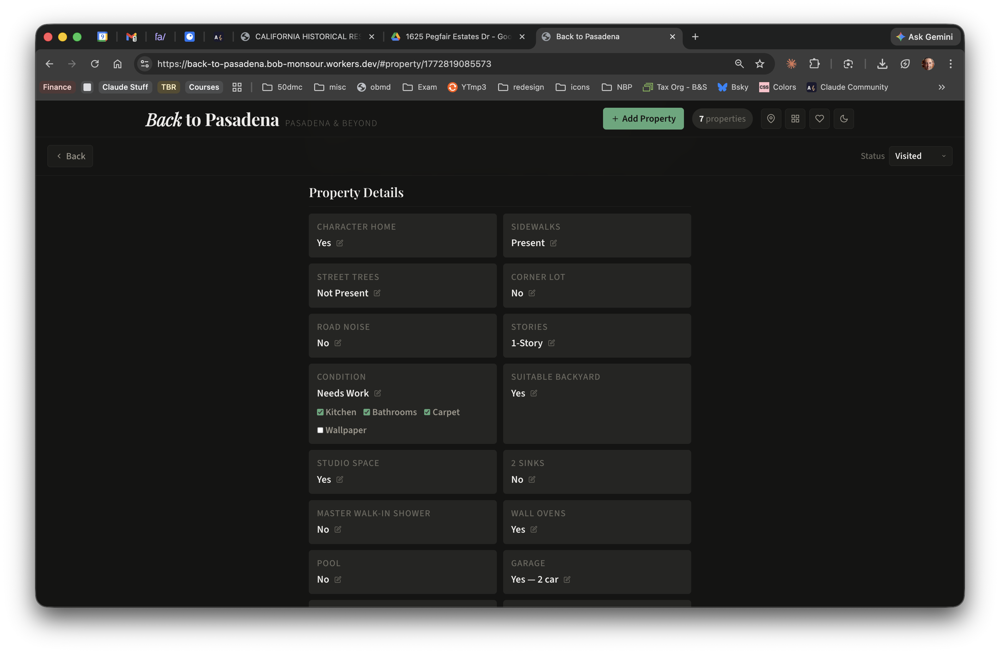
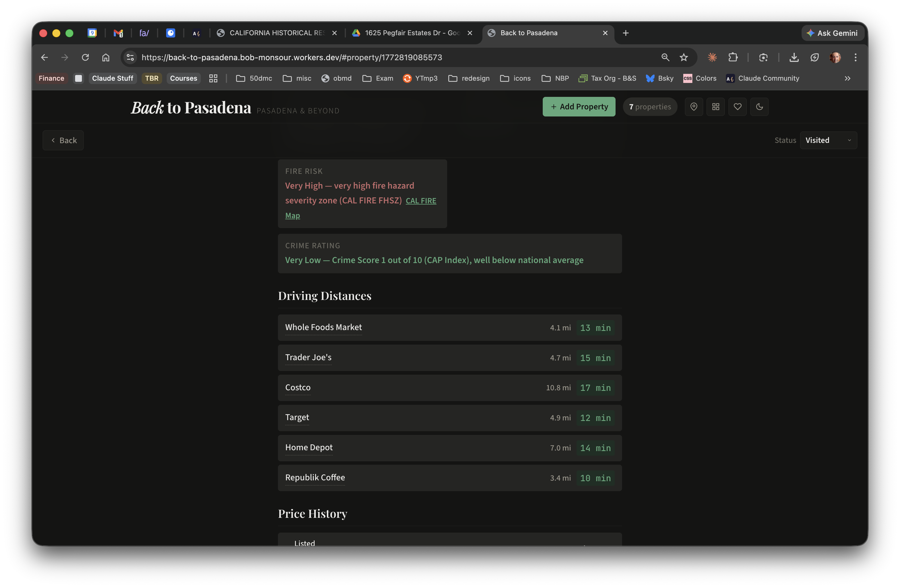

# House Hunting

A password-protected web app for comparing residential properties. Add listings by pasting Redfin URLs, and the app automatically scrapes property data, researches the neighborhood, calculates distances to stores you care about, and pulls fire and flood risk from government APIs. Everything is presented in a card grid with sorting, filtering, detailed views, and side-by-side comparison.

Built as a static site with [Eleventy 3](https://www.11ty.dev/) and deployed to [Cloudflare Workers](https://developers.cloudflare.com/workers/) with KV for mutable state.



## Features

- **Add properties by URL** — Paste a Redfin listing link and the app does the rest
- **Automated research pipeline** — Scrapes listing data, geocodes the address, queries fire/flood risk APIs, fetches neighborhood info via Claude, and calculates driving distances
- **Card grid** — Sortable by price, sqft, beds, baths, age, date listed, or days on market. Filterable by search text, favorites, and status
- **Full-page detail view** — Photo gallery with lightbox, price history, agent info, risk ratings, distances, and neighborhood description
- **Inline-editable property traits** — Track things you notice on visits: sidewalks, street trees, corner lot, road noise, stories, condition, backyard, studio, two sinks, wall ovens, pool, walk-in shower, character home, garage
- **Side-by-side comparison** — Compare 2-3 properties across all attributes, with best values highlighted
- **Favorites and status tracking** — Mark favorites, set status (New, Interested, Toured, Offer, Rejected), and write freeform notes
- **Photo gallery and lightbox** — Browse up to 20 listing photos with arrow key and swipe navigation
- **Map view** — See property location on Google Maps from the detail page
- **Fire and flood risk** — Queried from CAL FIRE FHSZ and FEMA NFHL ArcGIS APIs (no keys required)
- **Light/dark mode** — Automatic theme based on system preference, with manual toggle
- **Password protection** — Simple shared-password auth with token stored in localStorage
- **Hash routing** — Detail views at `#property/{id}` support browser back/forward



## Architecture

```
Browser (static HTML/CSS/JS)
  │
  ├── Static assets built by Eleventy ──► Served from _site/
  │     Property data baked into window.__HOUSES__
  │
  └── API calls ──► Cloudflare Worker ──► Cloudflare KV
                     /api/auth             state:{id} (notes, status, favorites, traits)
                     /api/state            stub:{id}  (pending properties to research)
                     /api/state/:id
                     /api/addresses
```

### Data flow

1. **Add a property** — User submits a Redfin URL via the app. The Worker parses the address and city from the URL path and writes a stub to KV.
2. **Build-time research** — Eleventy's `before` event runs `sync-kv.js`, which finds pending stubs (local and remote KV), runs the full research pipeline for each, and writes JSON data files and downloaded photos. Then `pull-state.js` fetches mutable state from remote KV.
3. **Static build** — Eleventy reads the JSON files via `src/_data/houses.js` and bakes all property data into `window.__HOUSES__` in the HTML template.
4. **Runtime** — The client merges static data with live mutable state fetched from `/api/state`. All edits (notes, status, favorites, traits) are persisted back to KV via PATCH requests.

### Research pipeline

When a new property stub is processed, `scripts/research.js` runs these steps:

1. **Redfin scrape** — Fetches the listing page and extracts JSON-LD structured data (price, beds, baths, sqft, year built, photos, coordinates, date listed) plus embedded price history and agent info
2. **Geocoding** — Uses coordinates from Redfin, or falls back to Google Maps geocoding, or the US Census geocoder (free, no key needed)
3. **Fire risk** — Queries CAL FIRE FHSZ ArcGIS REST API (SRA + LRA layers)
4. **Flood risk** — Queries FEMA NFHL ArcGIS REST API and interprets zone codes
5. **Neighborhood research** — Claude (Sonnet) web search for neighborhood description, park proximity, and crime rating
6. **Distances** — Google Maps Distance Matrix to preset store locations, keeping only the closest per store name
7. **Photos** — Downloads up to 20 listing images
8. **Output** — Writes combined JSON to `src/_data/houses/{id}.json`



## Making it your own

### Prerequisites

- Node.js 18+
- A [Cloudflare account](https://dash.cloudflare.com/sign-up) (free tier works)
- [Wrangler CLI](https://developers.cloudflare.com/workers/wrangler/install-and-update/) (`npm install -g wrangler`)

### 1. Clone and install

```sh
git clone <your-repo-url>
cd house-hunting
npm install
```

### 2. Create a KV namespace

```sh
wrangler kv namespace create HOUSES
wrangler kv namespace create HOUSES --preview
```

Update `wrangler.toml` with the IDs from the output:

```toml
[[kv_namespaces]]
binding = "HOUSES"
id = "<your-kv-id>"
preview_id = "<your-preview-kv-id>"
```

### 3. Set environment variables

Create a `.env` file:

```sh
ANTHROPIC_API_KEY=sk-ant-...       # For Claude neighborhood research
GOOGLE_MAPS_API_KEY=AIza...        # For distance matrix + geocoding (optional)
WORKER_URL=https://your-app.workers.dev  # Your deployed worker URL
APP_PASSWORD=your-secret-password  # Shared app password
```

Set the password as a Cloudflare Workers secret:

```sh
wrangler secret put APP_PASSWORD
```

### 4. Customize destinations

Edit the `DESTINATIONS` array in `scripts/research.js` to list the stores and locations you care about. Each entry has a `name` and `address`. Multiple entries with the same `name` are supported; only the closest will be kept.

```js
const DESTINATIONS = [
  { name: "Whole Foods Market", address: "465 S Arroyo Pkwy, Pasadena, CA 91105" },
  { name: "Trader Joe's", address: "345 S Lake Ave, Pasadena, CA 91101" },
  // Add your own...
];
```

### 5. Run locally

```sh
npm run dev
```

This builds the static site with Eleventy and starts a local Wrangler dev server. Visit `http://localhost:8787`.

### 6. Deploy

```sh
npm run deploy
```

## Commands

| Command | Description |
|---|---|
| `npm run build` | Build static site (syncs KV stubs + pulls state as a prebuild step) |
| `npm run dev` | Build + start local Wrangler dev server |
| `npm run deploy` | Build + deploy to Cloudflare Workers |
| `npm run sync` | Process pending address stubs from KV without a full build |
| `npm run research` | Manually research a property: `node scripts/research.js "<address>" "<city>" <id> "<redfinUrl>"` |

## Tech stack

| Layer | Technology |
|---|---|
| Static site generator | [Eleventy 3](https://www.11ty.dev/) (ESM, Nunjucks templates) |
| Hosting + API | [Cloudflare Workers](https://developers.cloudflare.com/workers/) with static assets |
| Mutable state | [Cloudflare KV](https://developers.cloudflare.com/kv/) |
| Listing data | Redfin scraping (JSON-LD + embedded React state) |
| Neighborhood research | [Claude API](https://docs.anthropic.com/en/docs/overview) (Sonnet) with web search |
| Distances | [Google Maps Distance Matrix API](https://developers.google.com/maps/documentation/distance-matrix) |
| Fire risk | [CAL FIRE FHSZ ArcGIS API](https://services.gis.ca.gov/arcgis/rest/services/Environment/Fire_Severity_Zones/MapServer) |
| Flood risk | [FEMA NFHL ArcGIS API](https://hazards.fema.gov/arcgis/rest/services/public/NFHL/MapServer/28) |
| Geocoding | Google Maps Geocoding API, US Census geocoder (fallback) |
| Client-side JS | Native ES modules (no bundler) |
| Fonts | Playfair Display, Source Sans 3, JetBrains Mono (Google Fonts) |

## Project structure

```
src/
  _data/houses.js         Eleventy data file (reads per-property JSON)
  _data/houses/           Per-property JSON files (immutable research data)
  images/{id}/            Downloaded listing photos
  js/
    app.js                Entry point, auth, state, event wiring
    api.js                API client (auth, state CRUD, URL submission)
    add-property.js       Add-property modal
    cards.js              Card grid rendering, sorting, filtering
    detail.js             Detail view, photo gallery, lightbox, inline edits
    comparison.js         Side-by-side comparison view
    utils.js              Formatting helpers, theme toggle
  css/styles.css          All styles (CSS custom properties, light/dark themes)
  index.njk               Single-page app template
worker/index.js           Cloudflare Worker (auth, KV CRUD, Redfin URL parsing)
scripts/
  research.js             Research pipeline (scrape + APIs + Claude)
  sync-kv.js              Prebuild: process KV stubs, run research, write data
  pull-state.js           Prebuild: pull mutable state from remote KV
eleventy.config.js        Eleventy config (before-event hooks, passthrough copies)
wrangler.toml             Cloudflare Workers config
```

## License

Private project. Not licensed for redistribution.
